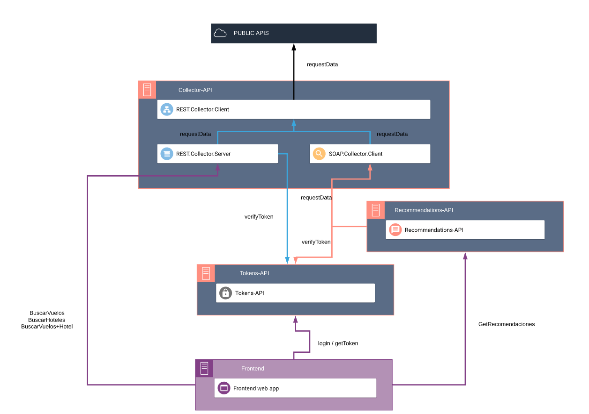
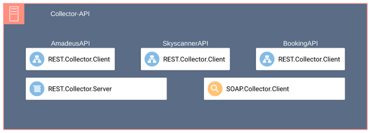

# EFE-Travel

## Tabla de contenidos

1. [Descripción del proyecto](#1-descripci%c3%b3n-del-proyecto)
    1.1. [Subsistemas del proyecto](#11-subsistemas-del-proyecto)
        1.1.1. [Collector-API](#111-collector-api)
        1.1.2. [Recommendations-API](#112-recommendations-api)
        1.1.3. [Tokens-API](#113-tokens-api)
        1.1.4. [Frontend](#114-frontend)
2. [Instalación y despliegue](#2-instalaci%c3%b3n-y-despliegue)

## 1. Descripción del proyecto

EFE-Travel es una aplicación basada en microservicios que permite a los usuarios realizar consultas sobre viajes y les proporciona recomendaciones basadas en su ubicación.
Los usuarios pueden realizar las siguientes operaciones:

* Buscar vuelos
* Buscar vuelos + hotel
* Buscar hoteles
* Ver recomendaciones de viajes

### 1.1. Subsistemas del proyecto

El sistema está compuesto por varios subsistemas conectados entre sí, definidos a continuación.

#### 1.1.1. Collector API

El subsistema Collector-API está compuesto por dos componentes principales (REST.Collector.Server y SOAP.Collector.Server) los cuales se encargan de proporcionar una interfaz definida independiente de las APIS Públicas que se estén utilizando (En este caso Amadeus API).
Estos componentes incorporan mediante un patrón Adapter una o varias bibliotecas REST.Controller.Client, las cuales se encargan de realizar peticiones a la API Pública correspondiente.

En este caso se ha utilizado una única biblioteca REST.Controller.Client que realiza peticiones a la API de desarrollo de Amadeus.

Todos los proyectos dentro del subsistema Collector-API se han realizado en C# (.NET Framework para SOAP.Collector.Client y .NET Core para el resto).

#### 1.1.2. Recommendations-API

El subsistema Recommendations-API se encarga de proporcionar una interfaz por medio de una API-REST que permita al usuario recibir recomendaciones de viajes dado su ubicación para diferentes fechas y diferentes destinos.
Este servicio realiza peticiones a SOAP.Collector.Client para poder obtener la información de los vuelos y hoteles disponibles y calcula cuales son los viajes recomendados que va a ofrecer el sistema.

Este proyecto está desarrollado en NodeJS y Typescript.

#### 1.1.3. Tokens-API

El subsistema Tokens-API es el servicio que funciona entre las peticiones del usuario y los servicios, de forma que para poder buscar vuelos, hoteles o recomendaciones, el usuario debe de estar registrado y proporcionar un token de sesión cada vez que quiera realizar búsquedas.

Este proyecto está realizado en NodeJS y Typescript y, además utiliza TypeORM y SQLite para guardar la información de los usuarios.

#### 1.1.4. Frontend

Este subsistema es el encargado de mostrar al usuario una interfaz gráfica por medio de una página web con la que poder realizar las llamadas al resto de APIs anteriormente mencionadas.

Este proyecto está realizado con VueJS, NuxtJS y Vuetify.

### 2. Instalación y despliegue